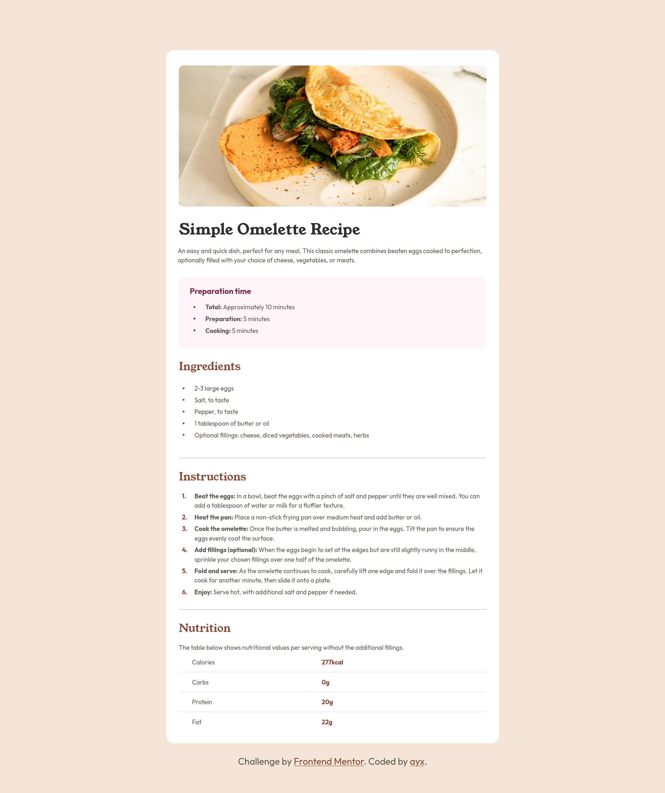

<!-- @format -->

# Frontend Mentor - Recipe page solution

This is a solution to the [Recipe page challenge on Frontend Mentor](https://www.frontendmentor.io/challenges/recipe-page-KiTsR8QQKm)

## Table of contents

-   [Overview](#overview)
    -   [Screenshot](#screenshot)
    -   [Links](#links)
-   [My process](#my-process)
    -   [Built with](#built-with)
    -   [What I learned](#what-i-learned)
        -   [HTML](#html)
            -   [Include content in landmarks](#include-content-in-landmarks)
        -   [CSS](#css)
            -   [Highlight color & focus outline](#highlight-color--focus-outline)
            -   [Positioning of `<li>` markers](#positioning-of-li-markers)
            -   [Misc](#misc)
    -   [Continued development](#continued-development)
    -   [Useful resources](#useful-resources)
-   [Author](#author)

## Overview

### Screenshot



### Links

# TODO CHANGE PROJECT URL

-   Solution URL: [Solution URL](https://github.com/ayx234/FM_Recipe_Page)
-   Live Site URL: [Live site URL](https://ayx234.github.io/FM_Recipe_Page)

## My process

### Built with

-   Semantic HTML5 markup
-   Mobile-first workflow

### What I learned

#### HTML

##### Include Content in Landmarks

-   All page content must be inside landmark elements
    -   Land mark elements are those that give context to what they hold
    -   Examples are `<header>,<main>,<footer>`, which are intrinsicly enterpreted by browsers as landmarks
        -   New browsers already know the roles of these elements and don't need them to be assigned role attributes.
        -   A `<div>` surrounding those elements can be given role="document" to be a landmark.
-   <section> Elements also need to be assigned roles. role="region" is one option.

#### CSS

##### Highlight Color & Focus Outline

###### Highlight Color

-   Style higlighted text and images using the selectors below:
    -   `::selection`
    -   `::-moz-selection`
-   Exclude selectors using `:not(<selector>)`.

###### Focus Outline

-   Change the outline color of focused elements using `:focus`
    ```CSS
       :focus {
       outline: none; /* Remove default outline */
       border: <length> <solid | ...> <color>;
       border-radius: <length>;
     }
    ```

##### Positioning of `<li>` Markers

-   Change the positioning of `<li>` **marker**

    -   `<ul>` **bullets**

        ````CSS
         .ul {
         list-style: none;
         }

         .ul .li {
           position: relative;
         }

         .ul .li::before {
           content: "•"; /* You can cange "•" to any marker you like */
           position: absolute;
           left: <lenght>;
         }
         ```

        ````

    -   `<ol>` **numbers**

        ```CSS
         .ol {
           counter-reset: custom-counter; /* Change "custom-counter" to any name you like */
           list-style: none;
         }

         .ol .li {
           counter-increment: custom-counter;
           position: relative;
         }

         .ol .li::before {
           content: counter(custom-counter) ". "; /* Change ". " for any text you want to follow the counter */
           position: absolute;
           left: <length>
         }
        ```

##### Misc

-   Variable and static fonts are imported the same way.
-   Change how text wraps using `text-wrap: <value>`
    -   Note: it doesn't work on all browsers yet.
-   Put `overflow: hidden` on the parent, not the child elememnts

### Continued development

#### General

-   Code structure and readability
-   Code maintainability

#### HTML

-   Accessibility

#### CSS

-   Layout
-   Positioning
-   Tables

### Useful resources

-   [CSS reset - Josh Comeau](https://www.joshwcomeau.com/css/custom-css-reset/) - Updated May 9th, 2025.

## Author

-   Frontend Mentor - [@ayx234](https://www.frontendmentor.io/profile/ayx234)
